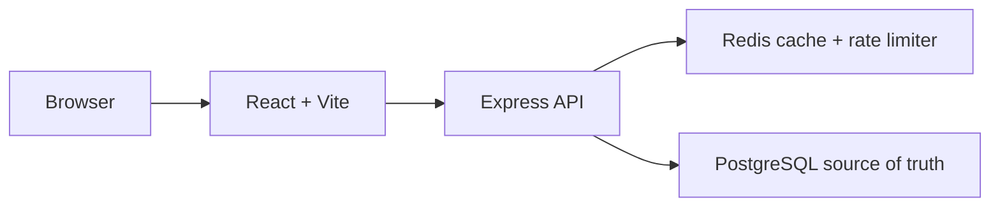

# Shortstack — Distributed URL Shortener

Shortstack is a portfolio-grade URL shortening platform for creating, managing, and observing reliable redirects. It combines a typed REST API, PostgreSQL as the source of truth, Redis for cache-aside reads and rate limiting, and a responsive React control room.

## What it demonstrates

- URL-safe short codes generated from PostgreSQL identity IDs using Base62
- Custom aliases with database-backed uniqueness protection
- Expiration, soft disable, deletion, and safe 302 redirects
- Redis cache-aside reads with PostgreSQL fallback when Redis is unavailable
- Atomic click counters that avoid lost updates under concurrency
- Redis fixed-window protection for URL creation
- OpenAPI-first API contracts with generated React Query hooks and Zod schemas
- Responsive dashboard, URL management, and statistics screens
- Docker Compose, health checks, structured logs, and GitHub Actions CI

## Architecture



See [docs/architecture.md](docs/architecture.md) for request flows, schema decisions, concurrency behavior, failure scenarios, and scaling notes.

## Stack

- TypeScript, React, Vite, Tailwind CSS
- Node.js, Express 5
- PostgreSQL, Drizzle ORM
- Redis via ioredis
- OpenAPI, Orval, Zod, TanStack Query
- Docker Compose and GitHub Actions

The repository was bootstrapped in a pnpm workspace so the frontend, shared API contract, database library, and API server can be developed together.

## Run locally

### Fastest option

```bash
pnpm install
pnpm --filter @workspace/db run push
pnpm --filter @workspace/api-spec run codegen
```

Start the API and frontend through the configured workflows, or run them from separate terminals:

```bash
pnpm --filter @workspace/api-server run dev
pnpm --filter @workspace/url-shortener run dev
```

The application expects `DATABASE_URL`. Redis is optional during local development; when unavailable, the API continues with PostgreSQL and logs a degraded-cache warning.

### Docker Compose

```bash
cp .env.example .env
docker compose up --build
```

The web application is available on port `5173`, the API on port `5000`, PostgreSQL on `5432`, and Redis on `6379`.

## API

The API contract lives in [`lib/api-spec/openapi.yaml`](lib/api-spec/openapi.yaml). Generated hooks are regenerated with:

```bash
pnpm --filter @workspace/api-spec run codegen
```

| Method | Endpoint | Description |
| --- | --- | --- |
| `GET` | `/api/healthz` | Health check |
| `GET` | `/api/v1/dashboard/summary` | Dashboard aggregates and recent URLs |
| `GET` | `/api/v1/urls` | Searchable, paginated URL mappings |
| `POST` | `/api/v1/urls` | Create a shortened URL |
| `GET` | `/api/v1/urls/{shortCode}` | Read URL metadata |
| `PATCH` | `/api/v1/urls/{shortCode}` | Update status or expiration |
| `DELETE` | `/api/v1/urls/{shortCode}` | Soft-disable a mapping |
| `GET` | `/api/v1/urls/{shortCode}/stats` | Read click statistics |
| `GET` | `/api/r/{shortCode}` | Routable 302 redirect endpoint |

Example:

```bash
curl -X POST http://localhost:5000/api/v1/urls \
  -H 'content-type: application/json' \
  -d '{"originalUrl":"https://example.com/a/long/path","customAlias":"demo"}'
```

## Testing and quality checks

```bash
pnpm run typecheck:libs
pnpm --filter @workspace/api-server run typecheck
pnpm --filter @workspace/url-shortener run typecheck
pnpm run build
```

## Configuration

Copy `.env.example` and set values for the environment. Never commit `.env`.

| Variable | Purpose | Default |
| --- | --- | --- |
| `DATABASE_URL` | PostgreSQL connection string | required |
| `REDIS_URL` | Redis connection string | optional |
| `REDIS_CACHE_TTL_SECONDS` | Mapping cache TTL | `3600` |
| `CREATE_RATE_LIMIT` | URL creations per minute per client | `30` |
| `SHORT_URL_BASE_URL` | Public URL base when deployed | request host |
| `CORS_ORIGIN` | Comma-separated allowed origins | permissive in local development |

## Future scale improvements

At higher traffic, click events can move to an append-only analytics path, Redis counters can be flushed with a database-backed lease, and redirect traffic can be split from management APIs. PostgreSQL remains the authority for mapping validity and alias uniqueness.

## License

MIT