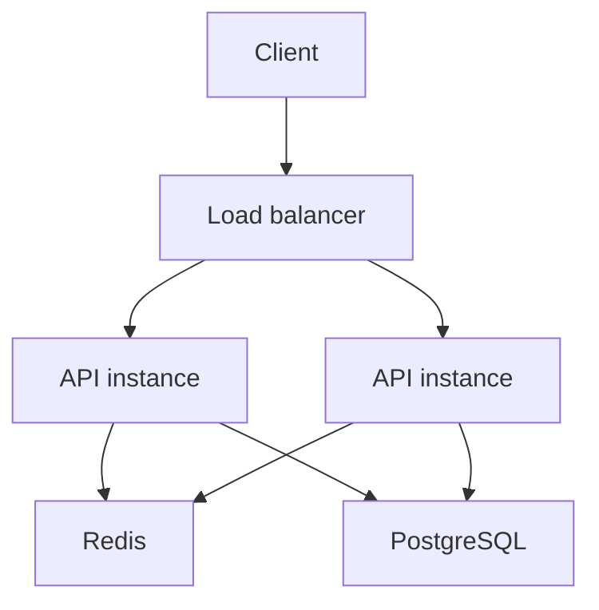
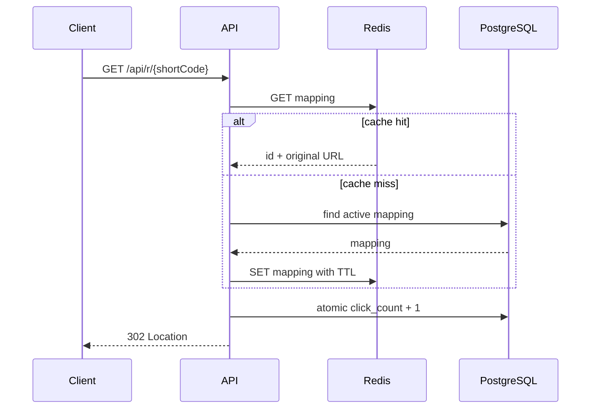

# Architecture

## System overview

Shortstack is a horizontally scalable modular monolith. Any number of API instances can run behind a load balancer because durable mapping state lives in PostgreSQL and shared cache/rate-limit state lives in Redis.

## URL creation

1. Validate the original URL, optional alias, and expiration.
2. Apply the shared Redis creation limit.
3. Insert a mapping into PostgreSQL.
4. For generated codes, encode the database identity ID with Base62 inside the same transaction.
5. Cache the resulting mapping.
6. Return a DTO; entities are never exposed directly.

The database unique constraint is the final defense against concurrent aliases. Application instances do not coordinate through JVM memory.

## Redirect path

302 is intentional: mappings may be disabled, expired, or changed, so clients should not permanently cache a redirect.

## Database design

`url_mappings` stores the canonical redirect record:

- `id`: PostgreSQL-generated identity.
- `short_code`: unique public alias or Base62 representation of `id`.
- `original_url`: validated destination, up to 2048 characters.
- `created_at`, `updated_at`, `expires_at`: timezone-aware instants.
- `active`: soft lifecycle flag.
- `click_count`: durable aggregate.

Click increments use `click_count = click_count + 1`, not a read/modify/write sequence, so concurrent redirects do not overwrite each other.

## Redis and consistency

Redis is cache-aside, never authoritative. A cache hit avoids the mapping read from PostgreSQL. If Redis is down, the service reads PostgreSQL directly and still redirects correctly. Cache writes and deletes are best-effort because a cache failure must not make the canonical data unavailable.

Updates and soft deletion evict the mapping key. A TTL provides a second safety boundary if an invalidation request cannot reach Redis. The first version keeps the click count durable with PostgreSQL; a future high-throughput analytics path may use Redis counters plus periodic persistence with a database-backed lease.

## Rate limiting

URL creation uses a fixed one-minute window stored in Redis. The key includes the client IP and the current window bucket. `INCR` is atomic across all API instances, so a load-balanced deployment shares one limit. Redis failures fail open for availability; production deployments should monitor and alert on this degraded behavior.

## Failure scenarios

- **Redis unavailable:** PostgreSQL remains sufficient for reads and writes; cache and rate-limit optimizations are bypassed.
- **PostgreSQL unavailable:** the API returns an error rather than inventing or accepting non-durable mappings.
- **Stale cache:** TTL and invalidation limit exposure; management mutations always remove the key.
- **Duplicate alias:** PostgreSQL uniqueness produces a conflict response even when requests race.
- **Concurrent click updates:** atomic SQL arithmetic preserves increments.

## Horizontal scaling

API instances are stateless. No local files, sessions, locks, or mutable singleton data are required for correctness. Hikari-style connection pooling is represented by the Node PostgreSQL pool in this runtime; pool sizing should be tuned against the database’s connection budget rather than scaled independently per instance.

## Current runtime boundary

The shared Replit workspace provides a pnpm/TypeScript application runtime, so the implemented deployable uses Express, Drizzle, and React while preserving the requested distributed-system design decisions. The OpenAPI contract, database source-of-truth model, Redis cache strategy, concurrency rules, Docker setup, and CI surface remain portable to a Java 21/Spring Boot implementation if the repository later moves to a Maven runtime.